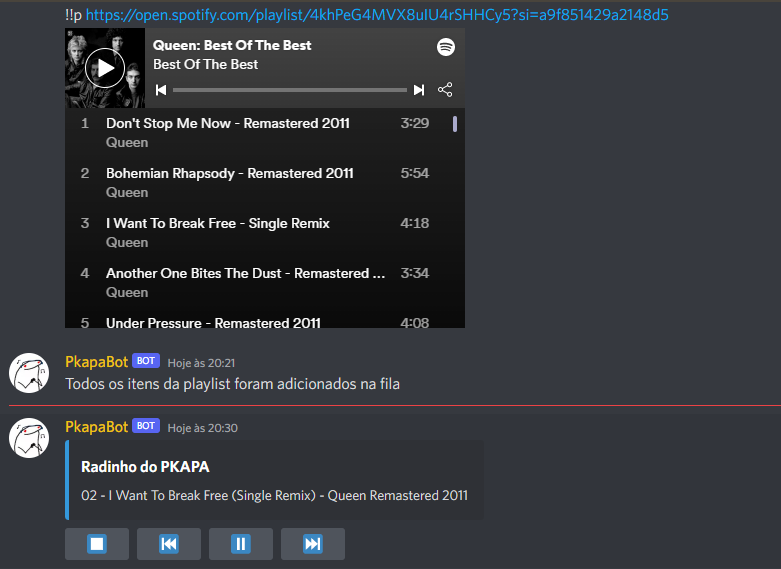
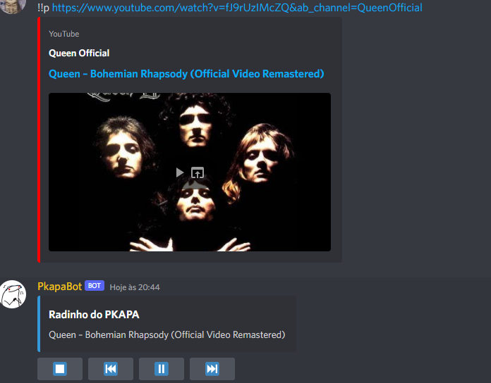
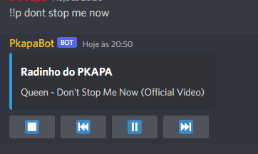

#  PkapaBot (Discord Music Bot)
> PkapaBot is a Discord Music Bot built with discord.js & uses Command Handler from [discordjs.guide](https://discordjs.guide)

## Requirements

1. Discord Bot Token **[Guide](https://discordjs.guide/preparations/setting-up-a-bot-application.html#creating-your-bot)**
4. Node.js

##  Getting Started 

```sh
git clone https://github.com/emersonv25/pkapaBot
cd pkapaBot
npm install
```

After installation finishes follow configuration instructions then run `npm start` to start the bot.

##  Configuration

Copy or Rename `.env_exemple` to `.env` and fill out the values:

⚠️ **Note: Never commit or share your token or api keys publicly** ⚠️

```

    TOKEN = TOKEN_HERE
    PREFIX = !!
    YOUTUBE_COOKIES = YOUR YOUTUBE COOKIES
    SPOTIFY_CLIENT_ID = CLIENT_ID
    SPOTIFY_CLIENT_SECRET = CLIENT_SECRET

```
##  Commands

> Note: The default prefix is '!!'

> The bot uses a queue system, when using the play command with a song in progress, it will be added to the queue


*  Play music from YouTube via url

`!!play https://www.youtube.com/watch?v=HgzGwKwLmgM&ab_channel=QueenOfficial`

*  Play music from YouTube via search query

`!!play Don t Stop Me Now`

*  Add all spotify playlist items to queue via url

`!!play https://open.spotify.com/playlist/4khPeG4MVX8uIU4rSHHCy5?si=a9f851429a2148d5`

*  Play Music from Spotify via url

`!!play https://open.spotify.com/track/5T8EDUDqKcs6OSOwEsfqG7`

* Join Voice Channel **(!!join, !!j)**
* Leave Voice Channel **(!!quit, !!exit, !!leave)**
* Play music or Add music to queue **(!!play, !!p)**
* Pause music **(!!pause)**
* Resume music **(!!resume, !!r)**
* Play next song **(!!skip, !!s, !!next)**
* Play previous song **(!!back)**
* Show ping to Discord API **(/ping)**
* Media Controls via Buttons

## Screenshots

Play spotify playlist



Play music from youtube with url



Play music from YouTube via search query

